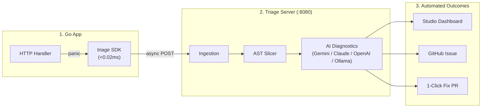

# triage

[](https://github.com/algotyrnt/triage/releases)
[](https://pkg.go.dev/github.com/algotyrnt/triage/sdk/go)
[](https://github.com/algotyrnt/triage/pkgs/container/triage)
[](https://github.com/algotyrnt/triage/actions/workflows/ci.yml)
[](https://codecov.io/gh/algotyrnt/triage)
[](LICENSE)

Triage intercepts runtime panics in Go HTTP services with sub-0.02ms overhead. It isolates the crash site alongside cross-file AST context (struct definitions, referenced types, helper functions), analyzes the root cause with pluggable LLMs (Gemini, OpenAI, Claude, or local Ollama), and opens 1-click bugfix PRs — all from a single zero-dependency container.



## Features

- **Multi-File AST Slicing:** Automatically extracts crashing functions, cross-file receiver structs, constructors, and referenced types.
- **Sub-0.02ms Client Overhead:** Bounded worker pool with non-blocking enqueue protects application throughput under heavy load.
- **Boundary-Aware AST Caching:** Fast SQLite and memory caching tiers deliver sub-millisecond symbol lookups without redundant API calls.
- **Pluggable AI Diagnostics:** Compatible with Google Gemini, OpenAI, Anthropic Claude, or local models via Ollama and vLLM.
- **1-Click Pull Requests:** Generates dedicated fix branches, synthesizes patch diffs with the configured LLM, and opens linked PRs.
- **Zero-Config Storage:** Single-file embedded SQLite with WAL mode and automatic schema migrations.

## Quickstart

### 1. Run Triage Server

Run the single-container image with embedded storage and studio dashboard:

```bash
docker run -d \
  --name triage \
  -p 8080:8080 \
  -v triage_data:/data \
  ghcr.io/algotyrnt/triage:latest
```

Open [http://localhost:8080](http://localhost:8080) to complete the setup wizard.

### 2. Add Middleware to Your Go App

```bash
go get github.com/algotyrnt/triage/sdk/go@latest
```

```go
package main

import (
	"net/http"
	triage "github.com/algotyrnt/triage/sdk/go"
)

func main() {
	mux := http.NewServeMux()
	mux.HandleFunc("/api/data", handleData)

	// Wrap your handler with Triage panic recovery middleware:
	handler := triage.Middleware(
		"your_api_key",
		"http://localhost:8080/api/v1/telemetry",
	)(mux)

	http.ListenAndServe(":8081", handler)
}
```

## Configuration

| Flag | Default | Description |
| :--- | :--- | :--- |
| `--port` | `8080` | HTTP server listening port |
| `--data-dir` | `data` | Directory for embedded SQLite database |
| `--db` | `<data-dir>/triage.db` | Explicit SQLite database file path |
| `--log-level` | `info` | Log verbosity (`debug`, `info`, `warn`, `error`) |

## Documentation

Full documentation, architecture deep dives, and API specifications are available at [**triage.algotyrnt.com**](https://triage.algotyrnt.com).

## Development

```bash
make help          # View all Makefile targets
make check         # Run lint, vet, and test matrix
make test-race     # Run tests with race detector
make dev-engine    # Start server on :8080
make dev-dashboard # Start studio dashboard on :3000
```

## Community

Triage is an open source project under the [Apache License 2.0](LICENSE).

- **Contributing:** See [CONTRIBUTING.md](CONTRIBUTING.md) to get started.
- **Support:** See [SUPPORT.md](SUPPORT.md) for questions and discussions.
- **Security:** See [SECURITY.md](SECURITY.md) to report vulnerabilities.
